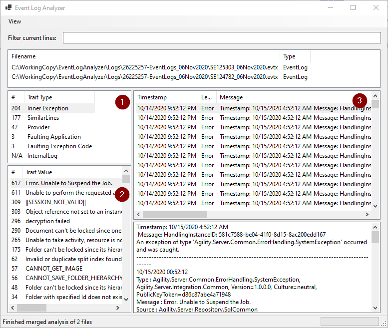

# EventLogAnalyzer

Windows Event Log viewer to quickly expose frequently ocurring issues across multiple evtx files.

Drag and drop any number of evtx files and analysis will be performed across them.

1. Trait types display values within
2. Trait values display all of the events with that trait value
3. Display the full message of any individual event

## Trait Types

### General types

* SimilarLines - Find event messages that are similar, ideally to group the same type of message even if it contains variance like dates or GUIDs.  This analysis is parallelized to improve performance.
* Provider - Easily focus on a particular event provider
* Faulting Application - crash messages grouped by application name
* Faulting Exception Code - crash messages grouped by exception code.  Example: 0xc00000fd = stack overflow.  Use [Microsoft Error Lookup Tool](https://docs.microsoft.com/en-us/windows/win32/debug/system-error-code-lookup-tool) to identify codes.

### Specialized types

* Inner Exception - Could possibly be improved to be more general, but currently identifies messages written in the format used by Kofax TotalAgility, and within that identifies the inner exception message.  This shorter inner exception message is also used for similarity analysis, improving performance.
* InternalLog - Shows time taken in load an analysis

## Other functionality

* Search at top to filter the currently displayed events
* View > Toggle Line Property View shows a property grid of the current line to see any property of the object or underlying [EventRecord](https://docs.microsoft.com/en-us/dotnet/api/system.diagnostics.eventing.reader.eventrecord) object.
* Not visible in the screenshot (requires scrolling), the list of trait values also shows the first and last occurrence of the included events.
* Run the included RegisterInPlace.ps1 script to register it as the default evtx file handler

## Requirements

* [.NET 6.0 or higher](https://dotnet.microsoft.com/download/dotnet)
